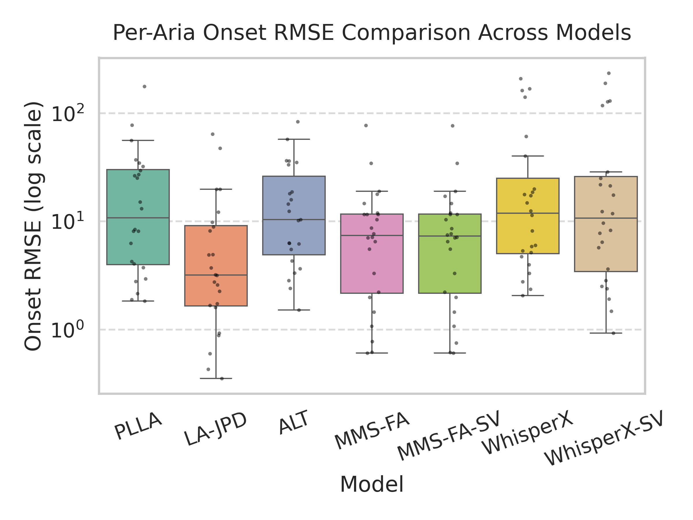
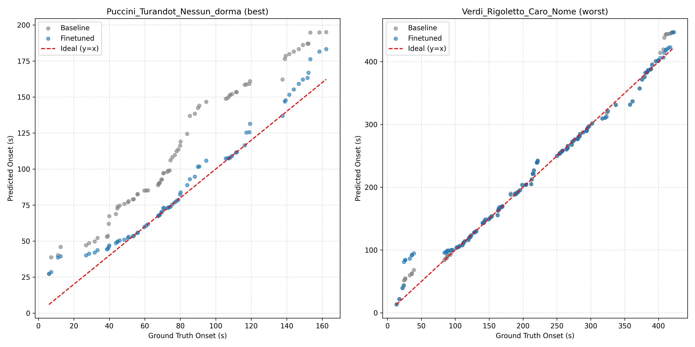

<!-- Badges -->
[](https://lrec2026.lrec-conf.org/)
[](https://huggingface.co/datasets/REPLACE_WITH_YOUR_ORG_AND_NAME)
[](LICENSE)

# Audio–Lyrics Alignment for Italian Opera Arias

> **Annotations are now available on Hugging Face.** The Aria audio downloader is still in progress — keep an eye out for the update.

Companion repository for *Audio–Lyrics Alignment Dataset for Italian Arias*, accepted at **LREC 2026** (Palma de Mallorca).

We release the **first audio–lyrics alignment dataset for Italian opera arias** — 24 arias from Handel to Puccini (~1h 53m), hand-annotated with **word-level timestamps** and per-word ARPAbet phoneme strings. We benchmark five state-of-the-art alignment systems on it and run a few-shot adaptation experiment. **Existing systems take a ~44% PCO hit moving from pop to opera, and few-shot fine-tuning helps locally but not globally.** See the [paper](#citation) for the full story.

<p align="center">
  &nbsp;&nbsp;
  &nbsp;&nbsp;
  &nbsp;&nbsp;
  
</p>

---

## The Aria Dataset

**24 arias, 1 h 53 m**, mean duration 284 s. Selected by two musicologist co-authors across composers, registers, and vocal traditions.

| Composer | Operas | Arias | Period | Genre |
|---|---|:---:|---|---|
| Handel | *Giulio Cesare* | 6 | early 18th c. | opera seria |
| Mozart | *Le nozze di Figaro*, *Don Giovanni* | 4 | late 18th c. | opera buffa |
| Rossini | *Il barbiere di Siviglia* | 3 | early 19th c. | opera buffa |
| Bellini | *I Puritani*, *Norma* | 2 | early 19th c. | melodramma |
| Verdi | *Rigoletto*, *La Traviata*, *Il Trovatore* | 8 | mid-19th c. | melodramma |
| Puccini | *Turandot* | 1 | early 20th c. | melodramma |

Each word is timestamped (start/end in seconds) and given an ARPAbet string (Italian variant from Arango et al., 2021), produced via an extended Italian SPARSAR pipeline (Delmonte, 2019) that handles archaic, apocopated, and contracted forms common in operatic Italian.

**Sample** — Bellini, *I puritani* (*Suoni la tromba*):

| Word | Start (s) | End (s) | ARPAbet |
|---|---:|---:|---|
| suoni | 2.24 | 3.17 | S W OW N IY |
| la | 3.27 | 3.37 | L AA |
| tromba | 3.47 | 4.04 | T R AO M B AA |
| intrepido | 4.34 | 5.94 | IY N T R EH P IY D OW |
| pugnerò | 6.74 | 7.53 | P UW N Y EY R OW |

Annotations (per-aria CSVs with `word`, `start_time`, `end_time`, `phonemes`) are available on [Hugging Face](https://huggingface.co/datasets/REPLACE_WITH_YOUR_ORG_AND_NAME). Audio is not redistributed — it is third-party content and must be sourced separately.

---

## Benchmarks

Five systems — three music aligners (PLLA, LA-JPD, ALT) and two speech forced aligners (MMS-FA, WhisperX), with and without Spleeter-separated vocals (`SV`). Mean ± standard error over the 24 arias.

| Model | Multilingual | RMSE ↓ | MAE ↓ | MedAE ↓ | PCO₀.₃ ↑ [%] |
|---|:---:|---:|---:|---:|---:|
| *Music alignment* | | | | | |
| PLLA (Schulze-Forster et al., 2021) | ✗ | 25.24 ± 7.7 | 20.94 ± 6.7 | 18.36 ± 6.5 | 30.45 ± 5.8 |
| LA-JPD (Huang et al., 2022) | ✓ | **9.44 ± 3.1** | **6.14 ± 2.3** | **3.46 ± 1.4** | 52.98 ± 5.6 |
| ALT (Gupta et al., 2019) | ✗ | 18.49 ± 4.3 | 13.51 ± 3.7 | 9.58 ± 3.3 | 20.69 ± 3.5 |
| *Speech models* | | | | | |
| MMS-FA (Ashraf, 2024) | ✓ | 11.47 ± 3.2 | 7.45 ± 2.8 | 3.99 ± 2.1 | 55.43 ± 5.9 |
| MMS-FA-SV | ✓ | 11.26 ± 3.3 | 7.30 ± 2.8 | 3.98 ± 2.1 | **56.02 ± 6.0** |
| WhisperX (Bain et al., 2023) | ✓ | 39.43 ± 12.7 | 34.61 ± 12.1 | 33.37 ± 12.7 | 23.34 ± 4.4 |
| WhisperX-SV | ✓ | 41.35 ± 13.5 | 36.02 ± 12.6 | 34.64 ± 12.9 | 28.60 ± 5.7 |

Fine-tuning PLLA on a 17/7 train/test split (5 folds, 15 epochs, LR 1e-5) with pitch / noise / reverb / freq-mask augmentation:

| Model | RMSE ↓ | MAE ↓ | MedAE ↓ | PCO₀.₃ ↑ [%] |
|---|---:|---:|---:|---:|
| Baseline PLLA | 23.77 ± 3.0 | 19.95 ± 2.7 | 17.23 ± 2.3 | 26.38 ± 1.5 |
| **Fine-tuned PLLA (ours)** | **21.32 ± 3.3** | **17.44 ± 2.9** | **14.91 ± 2.3** | **27.37 ± 2.1** |




---

## Reproducing the paper

The expected local tree (once you have audio):

```text
dataset/Aria_Dataset/
├── <AriaName>/
│   ├── audio/song.mp3        # 16 kHz mono
│   ├── text/song.txt
│   └── labels.tsv            # Text, Start Time, End Time
└── word2phonemes.pickle
```

> ⚠️ Several aria folders contain spaces (e.g. `Norma_Casta Diva`). Preserve them verbatim — loaders match on exact names.

```bash
# Environment
conda env create -f environment_gpu.yml   # or environment_cpu.yml

# Benchmarks (Table 4) — see benchmarks/README.md for the per-script mapping
python -m benchmarks.benchmark_schufo
python -m benchmarks.benchmark_whisperx
python -m benchmarks.benchmark_gc
python -m benchmarks.benchmark_HBE
python -m benchmarks.benchmark_forced_aligner    # needs ctc_forced_aligner

# Few-shot fine-tuning (Table 5)
python train.py --dataset_path dataset/Aria_Dataset --epochs 15
```

Frozen per-aria metric pickles are committed under `benchmarks/results/` so the plot scripts (`box_plot.py`, `scatter_plot.py`, …) reproduce paper figures without re-running every system. For training you'll also need `checkpoint/base/model_parameters.pth` (PLLA baseline weights) and `files/phoneme2idx.pickle`. Run `python train.py --help` for the full flag list.

---

## Repository structure

| Path | Purpose |
|---|---|
| `benchmarks/` | Benchmark drivers and frozen results — [README](benchmarks/README.md) |
| `train.py`, `model.py`, `align.py`, `datahandler.py` | Few-shot training and PLLA inference |
| `evaluate_helper.py`, `eval_model.py` | Metrics (RMSE / MAE / MedAE / PCO@0.3) and model evaluation |
| `data_augmentation.py`, `repo_paths.py` | Augmentation stack and portable paths |
| `make_word_list.py`, `make_word2phoneme_dict.py`, `create_global_w2phdict.py`, `fix_w2ph.py` | Lexicon construction and repair |
| `box_plot.py`, `scatter_plot.py`, `overlaid_bar_plot.py`, `grouped_bar_plot.py`, `symbol_plot.py`, `plot_best_worst_alignment.py` | Plots used in the paper |
| `whisperx/` | Local WhisperX experiments |
| `publication/`, `hf_dataset_bundle/` | Word-level CSV exports and HF upload bundle |
| `scripts/`, `metadata/` | Dataset preparation helpers |
| `tests/` | Lyrics ↔ labels consistency check |
| `files/`, `checkpoint/`, `images/` | Phoneme index, baseline weights, figures/logos |

This repo is a fork of [schufo/lyrics-aligner](https://github.com/schufo/lyrics-aligner) (Schulze-Forster et al., 2021). The core alignment model is upstream; the dataset, training pipeline, benchmark suite, and publication tooling are new.

---

## Citation

```bibtex
@inproceedings{jajoria_2026_audio,
  author    = {Jajoria, Pushkar and Graciotti, Arianna and Casali, Giovanna and
               Alabi, Jesujoba O. and Delmonte, Rodolfo and Pompilio, Angelo and
               Tripodi, Rocco and McDermott, James and Klakow, Dietrich},
  title     = {Audio-Lyrics Alignment Dataset for Italian Arias},
  booktitle = {Proceedings of the 15th Language Resources and Evaluation
               Conference (LREC 2026)},
  year      = {2026},
  publisher = {ELRA Language Resources Association},
  address   = {Palma de Mallorca, Spain},
  month     = may,
}
```

If you use the underlying alignment model, please also cite Schulze-Forster et al., 2021 ([DOI](https://doi.org/10.1109/TASLP.2021.3091817)).

---

## Acknowledgements

Pushkar Jajoria was funded by the **DFG** — Project-ID 232722074 — SFB 1102. This work was also supported by the **Polifonia Project** (EU Horizon 2020, grant 101004746). Thanks to Badr M. Abdullah, Aravind Krishnan, Janaki Viswanathan, and the **LSV Lab at Saarland University**. Built on [schufo/lyrics-aligner](https://github.com/schufo/lyrics-aligner).

---

## License

Code: [MIT](LICENSE). Annotations: see the Hugging Face dataset card.